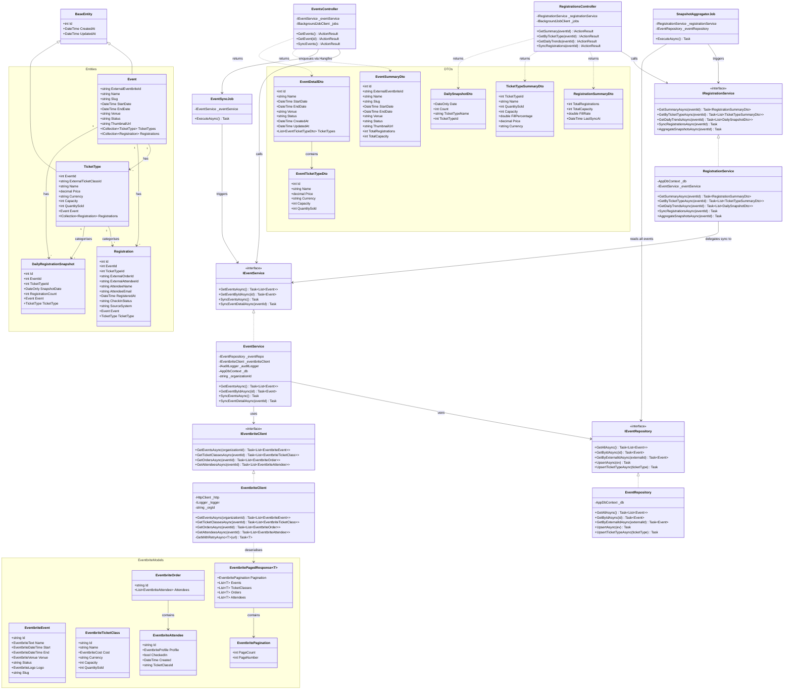

# Sprint 2 — Eventbrite Integration & Registration Dashboard
## Class Diagram

```mermaid
classDiagram
    %% ─────────────────────────────────────────
    %% SHARED / BASE
    %% ─────────────────────────────────────────
    class BaseEntity {
        +int Id
        +DateTime CreatedAt
        +DateTime UpdatedAt
    }

    %% ─────────────────────────────────────────
    %% DOMAIN ENTITIES
    %% ─────────────────────────────────────────
    namespace Entities {
        class Event {
            +string ExternalEventbriteId
            +string Name
            +string Slug
            +DateTime StartDate
            +DateTime EndDate
            +string Venue
            +string Status
            +string ThumbnailUrl
            +ICollection~TicketType~ TicketTypes
            +ICollection~Registration~ Registrations
        }
        class TicketType {
            +int EventId
            +string ExternalTicketClassId
            +string Name
            +decimal Price
            +string Currency
            +int Capacity
            +int QuantitySold
            +Event Event
            +ICollection~Registration~ Registrations
        }
        class Registration {
            +int Id
            +int EventId
            +int TicketTypeId
            +string ExternalOrderId
            +string ExternalAttendeeId
            +string AttendeeName
            +string AttendeeEmail
            +DateTime RegisteredAt
            +string CheckInStatus
            +string SourceSystem
            +Event Event
            +TicketType TicketType
        }
        class DailyRegistrationSnapshot {
            +int Id
            +int EventId
            +int TicketTypeId
            +DateOnly SnapshotDate
            +int RegistrationCount
            +Event Event
            +TicketType TicketType
        }
    }

    BaseEntity <|-- Event
    BaseEntity <|-- TicketType
    Event "1" --> "*" TicketType : has
    Event "1" --> "*" Registration : has
    Event "1" --> "*" DailyRegistrationSnapshot : has
    TicketType "1" --> "*" Registration : categorises
    TicketType "1" --> "*" DailyRegistrationSnapshot : categorises

    %% ─────────────────────────────────────────
    %% EVENTBRITE INTEGRATION MODELS
    %% ─────────────────────────────────────────
    namespace EventbriteModels {
        class EventbriteEvent {
            +string Id
            +EventbriteText Name
            +EventbriteDateTime Start
            +EventbriteDateTime End
            +EventbriteVenue Venue
            +string Status
            +EventbriteLogo Logo
            +string Slug
        }
        class EventbriteTicketClass {
            +string Id
            +string Name
            +EventbriteCost Cost
            +string Currency
            +int Capacity
            +int QuantitySold
        }
        class EventbriteOrder {
            +string Id
            +List~EventbriteAttendee~ Attendees
        }
        class EventbriteAttendee {
            +string Id
            +EventbriteProfile Profile
            +bool CheckedIn
            +DateTime Created
            +string TicketClassId
        }
        class EventbritePagedResponse~T~ {
            +EventbritePagination Pagination
            +List~T~ Events
            +List~T~ TicketClasses
            +List~T~ Orders
            +List~T~ Attendees
        }
        class EventbritePagination {
            +int PageCount
            +int PageNumber
        }
    }

    EventbritePagedResponse --> EventbritePagination : contains
    EventbriteOrder --> EventbriteAttendee : contains

    %% ─────────────────────────────────────────
    %% EVENTBRITE CLIENT
    %% ─────────────────────────────────────────
    class IEventbriteClient {
        <<interface>>
        +GetEventsAsync(organizationId) Task~List~EventbriteEvent~~
        +GetTicketClassesAsync(eventId) Task~List~EventbriteTicketClass~~
        +GetOrdersAsync(eventId) Task~List~EventbriteOrder~~
        +GetAttendeesAsync(eventId) Task~List~EventbriteAttendee~~
    }
    class EventbriteClient {
        -HttpClient _http
        -ILogger _logger
        -string _orgId
        +GetEventsAsync(organizationId) Task~List~EventbriteEvent~~
        +GetTicketClassesAsync(eventId) Task~List~EventbriteTicketClass~~
        +GetOrdersAsync(eventId) Task~List~EventbriteOrder~~
        +GetAttendeesAsync(eventId) Task~List~EventbriteAttendee~~
        -GetWithRetryAsync~T~(url) Task~T~
    }

    IEventbriteClient <|.. EventbriteClient
    EventbriteClient ..> EventbritePagedResponse~T~ : deserialises

    %% ─────────────────────────────────────────
    %% REPOSITORY
    %% ─────────────────────────────────────────
    class IEventRepository {
        <<interface>>
        +GetAllAsync() Task~List~Event~~
        +GetByIdAsync(id) Task~Event~
        +GetByExternalIdAsync(externalId) Task~Event~
        +UpsertAsync(ev) Task
        +UpsertTicketTypeAsync(ticketType) Task
    }
    class EventRepository {
        -AppDbContext _db
        +GetAllAsync() Task~List~Event~~
        +GetByIdAsync(id) Task~Event~
        +GetByExternalIdAsync(externalId) Task~Event~
        +UpsertAsync(ev) Task
        +UpsertTicketTypeAsync(ticketType) Task
    }

    IEventRepository <|.. EventRepository

    %% ─────────────────────────────────────────
    %% SERVICES
    %% ─────────────────────────────────────────
    class IEventService {
        <<interface>>
        +GetEventsAsync() Task~List~Event~~
        +GetEventByIdAsync(id) Task~Event~
        +SyncEventsAsync() Task
        +SyncEventDetailAsync(eventId) Task
    }
    class EventService {
        -IEventRepository _eventRepo
        -IEventbriteClient _eventbriteClient
        -IAuditLogger _auditLogger
        -AppDbContext _db
        -string _organizationId
        +GetEventsAsync() Task~List~Event~~
        +GetEventByIdAsync(id) Task~Event~
        +SyncEventsAsync() Task
        +SyncEventDetailAsync(eventId) Task
    }

    IEventService <|.. EventService
    EventService --> IEventRepository : uses
    EventService --> IEventbriteClient : uses

    class IRegistrationService {
        <<interface>>
        +GetSummaryAsync(eventId) Task~RegistrationSummaryDto~
        +GetByTicketTypeAsync(eventId) Task~List~TicketTypeSummaryDto~~
        +GetDailyTrendsAsync(eventId) Task~List~DailySnapshotDto~~
        +SyncRegistrationsAsync(eventId) Task
        +AggregateSnapshotsAsync(eventId) Task
    }
    class RegistrationService {
        -AppDbContext _db
        -IEventService _eventService
        +GetSummaryAsync(eventId) Task~RegistrationSummaryDto~
        +GetByTicketTypeAsync(eventId) Task~List~TicketTypeSummaryDto~~
        +GetDailyTrendsAsync(eventId) Task~List~DailySnapshotDto~~
        +SyncRegistrationsAsync(eventId) Task
        +AggregateSnapshotsAsync(eventId) Task
    }

    IRegistrationService <|.. RegistrationService
    RegistrationService --> IEventService : delegates sync to

    %% ─────────────────────────────────────────
    %% BACKGROUND JOBS
    %% ─────────────────────────────────────────
    class EventSyncJob {
        -IEventService _eventService
        +ExecuteAsync() Task
    }
    class SnapshotAggregatorJob {
        -IRegistrationService _registrationService
        -IEventRepository _eventRepository
        +ExecuteAsync() Task
    }

    EventSyncJob --> IEventService : triggers
    SnapshotAggregatorJob --> IRegistrationService : triggers
    SnapshotAggregatorJob --> IEventRepository : reads all events

    %% ─────────────────────────────────────────
    %% CONTROLLERS
    %% ─────────────────────────────────────────
    class EventsController {
        -IEventService _eventService
        -IBackgroundJobClient _jobs
        +GetEvents() IActionResult
        +GetEvent(id) IActionResult
        +SyncEvents() IActionResult
    }
    class RegistrationsController {
        -IRegistrationService _registrationService
        -IBackgroundJobClient _jobs
        +GetSummary(eventId) IActionResult
        +GetByTicketType(eventId) IActionResult
        +GetDailyTrends(eventId) IActionResult
        +SyncRegistrations(eventId) IActionResult
    }

    EventsController --> IEventService : calls
    EventsController --> EventSyncJob : enqueues via Hangfire
    RegistrationsController --> IRegistrationService : calls

    %% ─────────────────────────────────────────
    %% DTOs
    %% ─────────────────────────────────────────
    namespace DTOs {
        class EventSummaryDto {
            +int Id
            +string ExternalEventbriteId
            +string Name
            +string Slug
            +DateTime StartDate
            +DateTime EndDate
            +string Venue
            +string Status
            +string ThumbnailUrl
            +int TotalRegistrations
            +int TotalCapacity
        }
        class EventDetailDto {
            +int Id
            +string Name
            +DateTime StartDate
            +DateTime EndDate
            +string Venue
            +string Status
            +DateTime CreatedAt
            +DateTime UpdatedAt
            +List~EventTicketTypeDto~ TicketTypes
        }
        class EventTicketTypeDto {
            +int Id
            +string Name
            +decimal Price
            +string Currency
            +int Capacity
            +int QuantitySold
        }
        class RegistrationSummaryDto {
            +int TotalRegistrations
            +int TotalCapacity
            +double FillRate
            +DateTime LastSyncAt
        }
        class TicketTypeSummaryDto {
            +int TicketTypeId
            +string Name
            +int QuantitySold
            +int Capacity
            +double FillPercentage
            +decimal Price
            +string Currency
        }
        class DailySnapshotDto {
            +DateOnly Date
            +int Count
            +string TicketTypeName
            +int TicketTypeId
        }
    }

    EventDetailDto --> EventTicketTypeDto : contains
    EventsController ..> EventSummaryDto : returns
    EventsController ..> EventDetailDto : returns
    RegistrationsController ..> RegistrationSummaryDto : returns
    RegistrationsController ..> TicketTypeSummaryDto : returns
    RegistrationsController ..> DailySnapshotDto : returns
```
